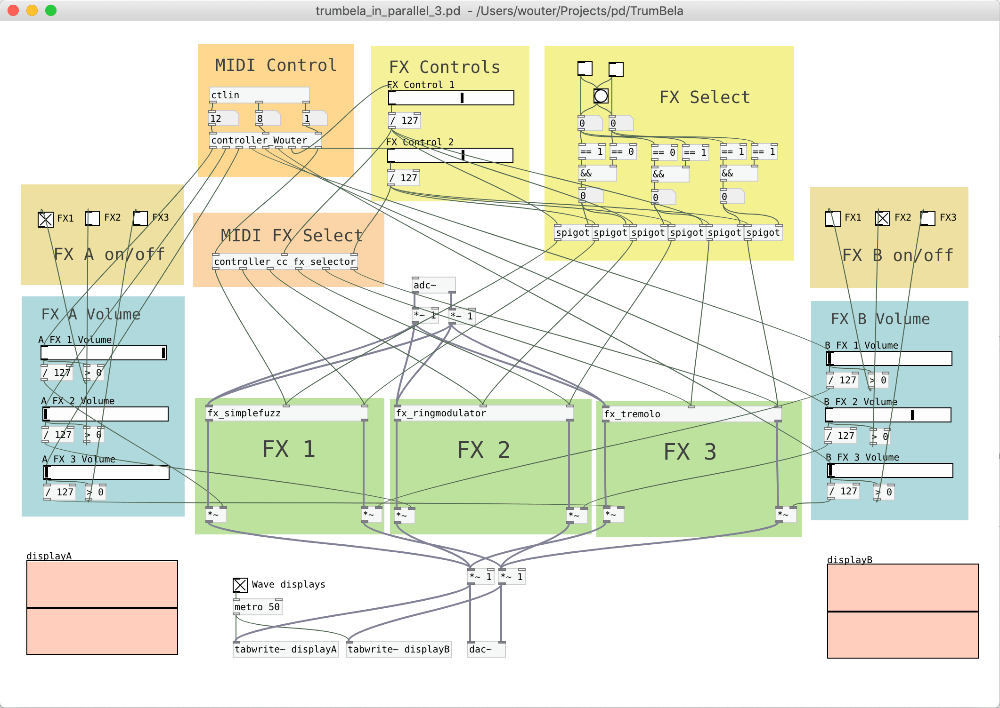

# TrumBela

TrumBela is an effects pedal for the [Bela](https://bela.io/) embedded audio computing platform.

The TrumBela is our first hardware/software project using the Bela and Pure Data. It is a single use device with no display other than 8 LEDs.

The FX box will have two mono inputs that each can be routed to any of the three effects. The outputs of the three effects are mixed to the single stereo output of the box.

The Bela has eight analog inputs, so the box will have eight knobs to adjust the effect settings:

- 3 knobs to send input A to the 3 effects
- 3 knobs to send input B to the 3 effects
- 2 knobs to edit the effect parameters (push buttons select which of the 3 effects is being edited)

An overview of the setup:


TrumBela can be used as an FX box for the Roland TR-8. The assignable A and B outputs of the TR 8 are used as sends and the mix in is used as returns. Specifically built for the toms, rimshot and clap but any of the voices can be assigned to Mix out, A or B as usual.

The Roland TR-8's inputs and outputs:


## The effects

As effects we'll use these examples from the [Guitar Extended](https://guitarextended.wordpress.com) blog:

```
https://guitarextended.wordpress.com/2011/12/12/creating-a-simple-effect-with-pd/ Creating a simple delay effect
https://guitarextended.wordpress.com/2011/12/28/simple-fuzz-effect-with-pure-data/ Simple Fuzz effect
https://guitarextended.wordpress.com/2011/12/28/phaserchorus-effect-with-pure-data/ Phaser/Chorus effect
https://guitarextended.wordpress.com/2012/01/03/tremolo-effect-with-pure-data/ Tremolo effect
https://guitarextended.wordpress.com/2012/01/06/simple-monophonic-fm-synthesizer-with-pure-data/ Simple monophonic FM synthesizer
https://guitarextended.wordpress.com/2012/01/07/vibrato-with-pure-data/ Vibrato
https://guitarextended.wordpress.com/2012/01/07/wha-wha-auto-with-pure-data/ Wha-wha (auto)
https://guitarextended.wordpress.com/2012/01/18/step-vibrato-effect-for-guitar-with-pure-data/ Step-vibrato effect for guitar
https://guitarextended.wordpress.com/2012/01/24/reverb-effect-in-pure-data/ Reverb Effect
https://guitarextended.wordpress.com/2012/02/06/ring-modulator-effect-using-pure-data/ Ring modulator effect
https://guitarextended.wordpress.com/2012/02/07/spectral-delay-effect-for-guitar-with-pure-data/ Spectral Delay effect for guitar
https://guitarextended.wordpress.com/2012/03/05/guitar-effects-chain-with-pure-data/ Guitar effects chain
https://guitarextended.wordpress.com/2012/04/04/polyphonic-synth-using-phase-vocoder-in-pure-data/ Polyphonic synth using phase vocoder
https://guitarextended.wordpress.com/2012/04/10/reversed-tape-violin-effect-for-guitar-with-pure-data/ Reversed tape / Violin effect for guitar
https://guitarextended.wordpress.com/2012/07/08/detuning-delay/ Detuning delay
https://guitarextended.wordpress.com/2012/07/10/thehexxciter-detuning-reverb-better/ TheHexxciter
https://guitarextended.wordpress.com/2013/08/05/making-a-looper-with-pure-data/ Looper
```

The dac~ and adc~ are removed from each of the tutorial fx units and replaced with inlets and outlets. This allows us to use them as modules in the master pedal board.

Two additional inlets in each effect allows two of the effect's parameters to be controlled from outside.

I can now add 8 faders and 8 switches. In order to have some control we are limited to 3 fx by two inputs equals siz volume knobs, six on/of buttons and 6 leds.

A PureData prototype to test the TrumBela setup with a regular MIDI controller:




